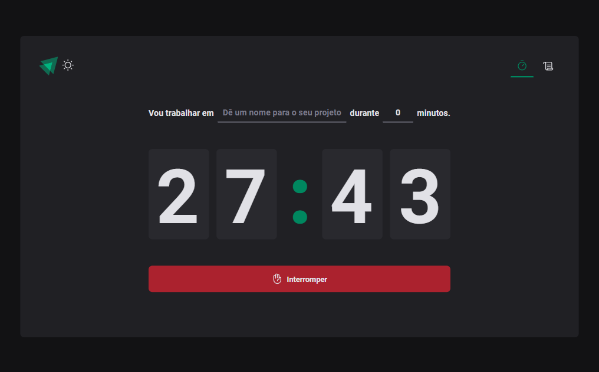
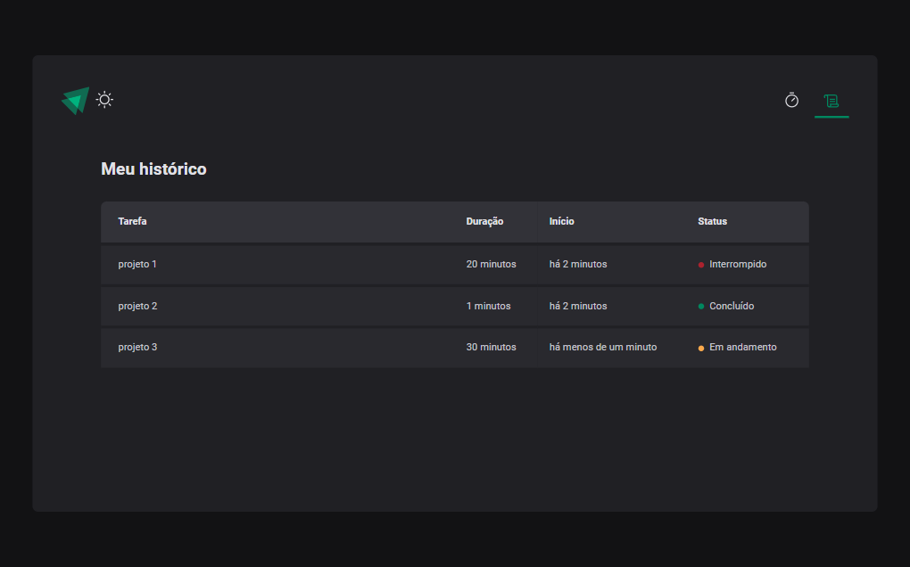

# Sobre o Projeto

O projeto consiste em um Pomodoro feito com ReactJS e Styled-components.

 

### 💡 O que aprendi:

- Aprofundei meu conhecimento em ReactJS.

- Explorei o uso do TypeScript, o que me ajudou a escrever um código mais limpo e seguro.

- Me diverti conhecendo mais o Styled-Components.

- Implementei o React Router Dom para a navegação entre páginas

- Utilizei o React Hook Form em conjunto com a validação com Zod para criar formulários.

- Explorei os Hooks do React e a Context API.

   

### 🔍 O que o projeto oferece:

- Um Pomodoro que permite que você crie ciclos, com nomes de tarefas e tempo de duração.

- Uma página de histórico dos ciclos, que permite visualizar o status de cada um deles. Você pode ver se o ciclo está em andamento, se foi concluído ou interrompido.

- Também fiz algumas implementações adicionais, aplicando responsividade na aplicação e tema claro.

 

# Layout do projeto

 

### Página inicial para definir um ciclo de tempo

### Página de Histórico (Onde fica os ciclos de tempo criados anteriormente)

# Tecnologias utilizadas

<ul>
  <li>JavaScript</li>
  <li>TypeScript</li>
  <li>ReactJS</li>
  <li>Styled-components</li>
  <li>Rotas (React Router Dom)</li>
  <li>Formularios (React Hook Form)</li>
  <li>validação (zod)</li>
</ul>
